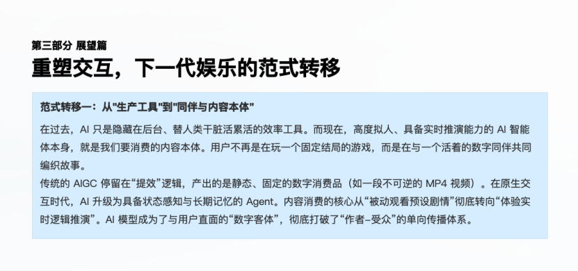

After generative AI deeply integrated into entertainment industry practices, development has moved beyond mere 'efficiency gains' — it's a comprehensive restructuring of production, experience, and business ecosystems. This piece shares insights from <strong>Xu Jinghui</strong>, CTO of <strong>Pole Interactive</strong>, a LinkX portfolio company. Drawing on Pole Interactive's hands-on experience, it systematically maps his understanding of AI entertainment's evolution, pain points, and breakthrough paths.

## Four Years of AI Entertainment Evolution: Technological Leaps and Tooling Gaps Coexist

Since ChatGPT ignited the AI wave in 2022, AI entertainment has evolved from single-modality to multi-modality over four years: from the emergence of LLM intelligence, to breakthroughs in static visual generation, to iterative progress in dynamic video generation, audio, and music generation — by 2026, we've entered a new phase of native multi-modal fusion.

Yet AI tools across different modalities still have significant gaps: static visual generation models struggle to understand physical laws, with details prone to collapse and serious content homogenization; dynamic video generation models suffer from physical logic errors and prohibitively high compute costs, raising the barrier for individual creators; audio and music generation models produce hard-to-edit tracks with chaotic beats. All of these constitute fundamental barriers to the industry's scaled development.

## Deep-Rooted Industry Pain Points: Three Layers of Barriers Constraining Scale

If tooling gaps are the foundational issue, the three barriers running through the technical base, industrial development, and manufacturing layers are the core obstacles — with the 'impossible triangle' at the technical base being the root cause.

At the industrial level, interactive text game requirements often exceed the 100,000-character safety boundary inherent in long-text narratives, leading to hallucination and logical breaks in generated content. Tightening global copyright regulation has also made compliance risks for visual asset generation increasingly prominent, making post-commercialization problems even more acute. Meanwhile, AI-generated content homogenization easily touches asset compliance boundaries. When content goes overseas in the future, it may face compliance reviews from streaming giants like Netflix.

At the manufacturing level, pain points concentrate on IP consistency and creative democratization. Commercial and IP-driven content demand extremely high IP characteristic consistency — subtle character changes can devalue the IP, and even building complex workflows can't perfectly solve this; while the high cost of video generation compute keeps individual creators' trial costs prohibitively high, and creative democratization remains confined to LLMs and static visual generation.

## Breakthrough Strategy: 'Human Artists Lead + AI Empowerment' as the Core

Facing current industry pain points, Xu Jinghui, drawing on Pole Interactive's practical experience, proposed a breakthrough strategy centered on 'human artists lead + AI empowerment' — this is also the fundamental path for Pole Interactive to solve compliance, homogenization, and IP inconsistency issues.

The core logic of this principle lies in clearly defining the boundary between human artists and AI, and adhering to a people-first creative philosophy. Specifically, in Pole Interactive's AI context, human artists assume irreplaceable core responsibilities: overall creative direction, aesthetic judgment, original IP design, and shaping the emotional core of content. This is what AI cannot replicate, and is the key to avoiding content homogenization and lack of emotional warmth.

In the creation and generation process, AI returns to its essence as a tool — a highly efficient auxiliary means that handles basic creation, batch content generation, repetitive editing, and other tedious work. Its core role is to reduce creative costs and improve production efficiency. This division of labor effectively solves the homogenization and emotional absence common in AI-generated content, while laying a solid foundation for digital asset compliance. With human artists leading and AI empowering collaborative production, we can build truly meaningful, sustainable, and reusable digital assets.

To drive this core strategy's implementation, the Pole team refines its execution plan from multiple dimensions.

At the IP compliance level, Pole Interactive adopts a 'dual-track parallel' strategy. In commercial IP partnerships, they first complete rights confirmation with top IP holders like Liu Cixin and Happy Mahua, then proceed with subsequent creation. For original IPs, they build a solid intellectual property compliance defense by preserving complete line drawings, manuscripts, and timestamp records.

At the technical level, Pole Interactive builds a multi-modal fusion processing pipeline on one hand, using feature locking technology to alleviate IP consistency issues. On the other hand, they employ a 'Agent microservice + core control' decoupled design, which can both adapt to rapid model iteration needs and effectively control security risks, ensuring stable implementation of core strategies.

## Future Outlook: Building a 'Netflix + Roblox' Super Sandbox Ecosystem

Xu Jinghui believes AI's role will evolve from a production assistance tool to a companion in content creation and experience, accompanying users in co-creating personalized stories. Meanwhile, digital assets will break modality barriers to achieve cross-scenario reuse. At the business level, the industry's development focus will shift from traditional 'attention monetization' to 'interaction/generation monetization'.

The AI entertainment industry will break free from the traditional model of pure PGC capacity expansion, creating a 'Netflix + Roblox' style super sandbox ecosystem — platforms become industry rule-makers by building top-tier premium content as the core worldview framework; simultaneously opening the interaction platform, allowing users to contribute digital assets within the established framework, participate in content creation, and even sell their original content, forming a 'platform builds framework, users create content' crowd-creation pattern that helps users achieve deep integration of entertainment, creation, and social connection in parallel universes.

## Conclusion: Technology as the Boat, Emotion as the Helm

From parchment to the printing press, from silicon chips to silicon-based large models, the core of every technological transformation in human history has been reducing the cost of expressing ourselves and finding emotional resonance. All exploration and development of AI entertainment will ultimately return to human emotional needs — this is the ultimate core value of AIGC in the entertainment field.

In the vast ocean of AIGC, AI's technology and security are the boats that carry our dreams. Only the creator's soul is the sole compass pointing toward the future.
