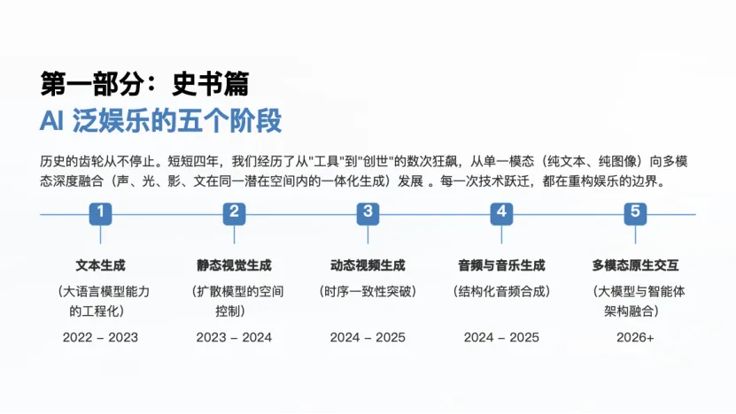
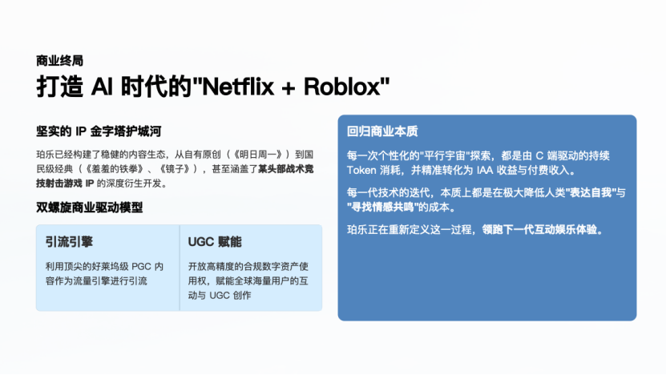

在生成式AI深入泛娱乐产业实践之后，行业发展已经不只是"效率提升"，而是生产、体验与商业生态层面的全方位重构。本文分享自星连资本被投企业**珀乐互动** CTO 徐京徽。结合珀乐互动科技的实战经验，系统梳理了他对AI泛娱乐行业演进、痛点及破局路径的理解。

## AI泛娱乐四年演进：技术跃迁与工具短板并存

自2022年ChatGPT引爆AI概念以来，四年间AI泛娱乐完成了单模态到多模态的演进：从大语言模型的智能涌现，到静态视觉生成的突破，再到动态视频生成、音频和音乐生成的迭代，2026年已迈向原生多模态融合新阶段。

但不同模态AI工具仍有短板：静态视觉生成模型难以理解物理规律、细节易崩坏，内容同质化严重；动态视频生成模型存在物理逻辑错误，算力成本高昂，个人创作者参与门槛高；音频、音乐生成音轨模型难编辑、节拍混乱。这些，均成为行业规模化发展的基础阻碍。

## 行业深层痛点：三重壁垒制约规模化发展

若说工具短板是基础问题，贯穿技术底层、产业发展、工业生产的三重壁垒才是核心阻碍，其中技术底层的"不可能三角"是根源。

在产业层面，互动文字游戏的需求往往超过了长文本叙事自身存在的10万字安全边界，导致生成的内容易出现幻觉、逻辑断裂。全球版权监管趋严也使得视觉资产生成合规风险愈加凸显，让商业化后问题更突出。同时，AI生成内容同质化容易触及到资产合规的边界。在未来出现内容出海需求时，内容很可能会面临Netflix等流媒体巨头的合规审查。

在工业层面，痛点更集中在IP一致性与创作平权上。商业片和IP化内容对IP特征一致性要求极高，细微形象变化就会让IP失值，即便搭建复杂工作流也难完美解决；而视频生成算力成本居高不下，使得个人创作者试错成本过高，创作平权还只能仅停留在大语言模型和静态视觉领域。

## 破局策略：以"人类艺术家主导+AI赋能"为核心

面对当前行业痛点，徐京徽结合珀乐互动实战经验，给出了以"人类艺术家主导+AI赋能"为核心的破局策略，这也是珀乐互动破解合规、同质化、IP不一致等问题的根本出路。

这一核心原则的核心逻辑，在于明确人类艺术家与AI的定位边界，坚守以人为本的创作初心。具体而言，在珀乐的AI语境中，人类艺术家承担着不可替代的核心职责，负责整体创意把控、审美方向判断、IP原创设计以及内容情感内核的塑造。这部分是AI无法复制的，也是避免内容同质化、缺乏情感温度的关键。

AI在创作与生成过程中回归工具本质，作为高效辅助手段承担基础创作、批量内容生成、重复性编辑等繁琐工作。其核心作用是降低创作成本，提升生产效率。这种分工模式，既有效解决了AI生成内容普遍存在的同质化、情感缺失等问题，也为数字资产的合规性奠定了坚实基础。用人类艺术家作为主导，加上AI的赋能去协同生产，才能构建真正有意义、可沉淀、可复用的数字资产。

为推动这一核心策略落地，珀乐团队从多维度细化执行方案。

在IP合规层面，珀乐采用"双轨并行"策略。在商业IP合作中，先与刘慈欣、开心麻花等顶级IP方完成确权，再开展后续创作。同时原创IP通过留存完整线稿、手稿及时间戳记录，筑牢知识产权合规防线。

在技术层面，珀乐一方面搭建多模态融合处理管线，借助特征锁定技术缓解IP一致性不足的问题。另一方面采用"Agent微服务化+核心中控"的解耦设计，既能适配模型快速迭代的需求，又能有效防控安全风险，确保核心策略稳定落地。

## 未来展望：打造"Netflix+Roblox"超级沙盒生态

徐京徽认为，未来AI的角色将从生产辅助工具升级为内容创作与体验的同伴，陪伴用户共创专属故事。与此同时，数字资产将打破模态壁垒，从而实现跨场景复用。在商业链路层面，行业的发展重点也将从传统的"注意力变现"，重构为"交互/生成变现"模式。

AI泛娱乐行业将摆脱纯PGC产能扩张的传统模式，打造"Netflix+Roblox"式超级沙盒生态——平台通过打造顶级精品内容作为核心世界观框架，成为行业规则的制定者；同时开放交互平台，让用户能在既定框架下贡献数字资产，参与内容创作，甚至售卖自身原创内容，形成"平台搭框架、用户做内容"的全民共创格局，助力用户在平行宇宙中实现娱乐、创作与社交的深度融合。

## 结语：技术为舟，情感为舵

从羊皮纸到印刷术，从硅片到硅基大模型，人类每一次技术变革的核心都是在降低人类表达自我和寻找情感共鸣的成本。而AI泛娱乐的所有探索与发展，最终也将回归人类的情感需求，这也是AIGC在泛娱乐领域的终极核心价值。

于AIGC的星辰大海中，AI的技术与安全是承载梦想的舟船。只有创作者的灵魂才是指引未来的唯一罗盘。
